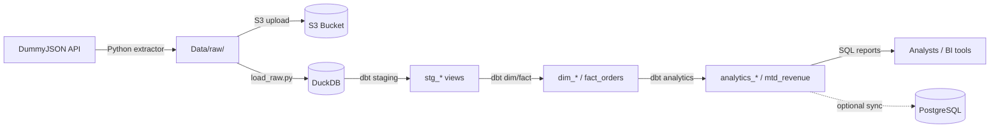

# Architecture — E-Commerce ELT Data Warehouse

## Overview

This pipeline follows an **ELT** (Extract, Load, Transform) pattern: raw data is landed first, then transformed inside the warehouse using dbt.



## Layer Details

| Layer | Tool | Location | Output |
|---|---|---|---|
| **Extract** | Python (`requests`, `boto3`) | `src/extraction/` | JSON in `Data/raw/<entity>/YYYY/MM/DD/` + S3 |
| **Load** | Python (`duckdb`) | `src/scripts/load_raw.py` | Staging tables in `Data/warehouse/warehouse.duckdb` |
| **Transform** | dbt + DuckDB | `src/transformations/` | Star schema + analytics tables |
| **Serve** | SQL + optional sync | `src/sql/reports/`, `sync_to_postgres.py` | KPI queries, PostgreSQL marts |
| **Orchestrate** | Python | `src/orchestrator.py` | End-to-end pipeline run |
| **Results** | Logs + dbt artifacts | `results/logs/`, `results/dbt/` | Logs, manifest, compiled SQL |

## Data Model (Star Schema)

```
                    ┌─────────────┐
                    │ dim_customer│
                    └──────┬──────┘
                           │ customer_key
                    ┌──────▼──────┐         ┌─────────────┐
                    │ fact_orders │◄────────│ dim_product │
                    └──────┬──────┘         └─────────────┘
                           │
              ┌────────────┼────────────┐
              ▼            ▼            ▼
   analytics_revenue_daily  mtd_revenue  analytics_customer_metrics
```

## Key Tables

| Table | Type | Description |
|---|---|---|
| `stg_customers`, `stg_products`, `stg_orders` | Staging | Cleaned raw data from JSON |
| `dim_customer`, `dim_product` | Dimension | Surrogate keys + business attributes |
| `fact_orders` | Fact | Order transactions with FKs to dimensions |
| `analytics_revenue_daily` | Mart | Daily revenue aggregation |
| `analytics_customer_metrics` | Mart | LTV and churn status per customer |
| `mtd_revenue` | Mart | Month-to-date revenue KPIs |
| `customer_churn` | Mart | Customer lifecycle classification |

## Run Order

1. `cd src && python -m extraction.extractor` — fetch API data
2. `cd src && python -m scripts.load_raw` — load JSON into DuckDB staging
3. `.\src\run_dbt.ps1 run` — build all models
4. `.\src\run_dbt.ps1 test` — validate data quality
5. `cd src && python analytics_report.py` — view dashboard (optional)

## Configuration

| File | Purpose |
|---|---|
| `config/profiles.yml` | DuckDB connection path (`Data/warehouse/warehouse.duckdb`) |
| `src/paths.py` | Central path constants for all Python modules |
| `.env` | AWS credentials and optional PostgreSQL DSN |

## Design Decisions

- **DuckDB over cloud warehouse** — zero-cost local development; same SQL patterns transfer to Redshift/Postgres.
- **Date-partitioned raw layer** — enables reprocessing by date and future S3 lifecycle policies.
- **dbt for transforms** — version-controlled SQL, built-in tests, and lineage documentation.
- **`order_date` proxy** — DummyJSON carts have no order timestamp; `current_date` is used at extraction time.
