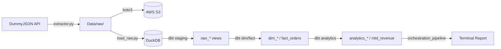

# E-Commerce ELT Data Warehouse — Revision Guide

Complete reference for concepts, architecture, workflow, testing, and expected outputs.

---

## 1. Project Overview

This project builds an **end-to-end ELT (Extract, Load, Transform) data pipeline** for e-commerce analytics. Raw data is pulled from a mock REST API (DummyJSON), stored in a data lake (local + AWS S3), loaded into DuckDB, transformed with dbt into a star schema, and surfaced as business analytics KPIs.

### Why ELT (not ETL)?

| ETL | ELT |
|---|---|
| Transform before loading into the warehouse | Load raw data first, transform inside the warehouse |
| Limited by staging compute | Uses warehouse SQL engine (DuckDB) for transforms |
| Harder to reprocess historical raw data | Raw layer preserved — re-run dbt anytime |

### Business Goal

Enable analysts to answer:

- What is total and daily revenue?
- Who are the top customers and products?
- What is average order value (AOV)?
- Which customers are active, at-risk, or churned?

---

## 2. Technology Stack

| Tool | Role |
|---|---|
| **Python** | API extraction, DuckDB loading, orchestration |
| **DummyJSON API** | Mock e-commerce source (`/products`, `/users`, `/carts`) |
| **AWS S3** | Cloud raw data lake (date-partitioned JSON) |
| **DuckDB** | Local analytical warehouse (`Data/warehouse/warehouse.duckdb`) |
| **dbt Core** | SQL transformations, tests, and lineage |
| **pytest** | Python unit tests for extraction and loading |
| **boto3** | S3 upload from Python extractor |

---

## 3. Architecture

### End-to-End Flow

```
DummyJSON API
      │
      ▼
Python Extractor (src/extraction/)
      │
      ├──► Data/raw/<entity>/YYYY/MM/DD/*.json   (local data lake)
      │
      └──► s3://<bucket>/raw/<entity>/YYYY/MM/DD/*.json
                │
                ▼
         load_raw.py → DuckDB staging tables (main.stg_*)
                │
                ▼
         dbt run → staging views → dim/fact → analytics marts
                │
                ▼
         Analytics Report (orchestration_pipeline.py)
```

### Mermaid Diagram



### Star Schema

```
                 ┌──────────────┐
                 │ dim_customer │
                 └──────┬───────┘
                        │ customer_key
                 ┌──────▼───────┐      ┌─────────────┐
                 │  fact_orders │◄─────│ dim_product │
                 └──────┬───────┘      └─────────────┘
                        │
         ┌──────────────┼──────────────┐
         ▼              ▼              ▼
analytics_revenue_daily  mtd_revenue  analytics_customer_metrics
                                        customer_churn
```

### Key Tables

| Layer | Table | Description |
|---|---|---|
| Raw (Python) | `main.stg_customers`, `stg_products`, `stg_orders` | JSON loaded by `load_raw.py` |
| Staging (dbt) | `main_dbt.raw_customers`, `raw_products`, `raw_orders` | Unnested, cleaned views |
| Dimension | `main_dbt.dim_customer`, `dim_product` | Surrogate keys + attributes |
| Fact | `main_dbt.fact_orders` | Order transactions with FKs |
| Analytics | `analytics_revenue_daily`, `analytics_customer_metrics`, `mtd_revenue`, `customer_churn` | Business KPI marts |

---

## 4. Project Structure

```
ecommerce-elt-data-warehouse/
├── orchestration_pipeline.py   # One-command full pipeline
├── run_dbt.ps1                 # dbt wrapper (repo root)
├── README.md                   # Quick start
├── requirements.txt
├── pytest.ini
├── config/
│   └── profiles.yml            # DuckDB dbt connection
├── src/
│   ├── extraction/             # API client + S3 upload
│   ├── scripts/                # load_raw.py, sync_to_postgres.py
│   ├── transformations/        # dbt project (models, macros, tests)
│   ├── sql/reports/            # Analyst SQL queries
│   ├── paths.py                # Shared path constants
│   ├── orchestrator.py         # Step-by-step orchestrator
│   ├── analytics_report.py     # Rich terminal dashboard
│   └── run_dbt.ps1
├── Data/                       # Local data (not committed)
│   ├── raw/                    # Extracted JSON
│   ├── processed/              # Reserved
│   └── warehouse/              # warehouse.duckdb
├── results/                    # Logs + dbt artifacts (not committed)
├── tests/                      # pytest suite
└── Documents/
    ├── revision.md             # This file
    ├── planning/               # SDD specs (spec_1 – spec_9)
    └── SDD_Ecommerce_ELT.md
```

---

## 5. Module Workflow (Development Roadmap)

| Module | Name | What It Does | Key Files |
|---|---|---|---|
| 0 | Planning | SDD, specs, master plan | `Documents/planning/` |
| 1 | Project Setup | Folder layout, config, gitignore | `README.md`, `config/`, `Data/` |
| 2 | Data Extraction | Fetch JSON from DummyJSON + S3 upload | `src/extraction/` |
| 3 | Raw Data Storage | Date-partitioned paths local + S3 | `extractor.py` |
| 4 | Data Loading | Load JSON → DuckDB staging | `src/scripts/load_raw.py` |
| 5 | Data Modeling | Star schema via dbt | `models/staging/`, `dim/`, `fact/` |
| 6 | Analytics | Revenue, churn, LTV marts | `models/analytics/`, `schema.yml` |
| 7 | Reporting | SQL reports + orchestration | `sql/reports/`, `orchestration_pipeline.py` |
| 8 | Documentation | README + revision guide | `Documents/revision.md` |
| 9 | GitHub | CONTRIBUTING, issue/PR templates | `.github/`, `CONTRIBUTING.md` |

---

## 6. Pipeline Workflow (Step by Step)

### Option A — One Command (Recommended)

```powershell
cd ecommerce-elt-data-warehouse
.\.venv\Scripts\Activate.ps1
python orchestration_pipeline.py
```

Runs in order:

1. **Extract** — DummyJSON API → `Data/raw/` + S3
2. **Load** — JSON → DuckDB staging tables
3. **Transform** — `dbt run` (staging → dim/fact → analytics)
4. **Test** — `dbt test` (35 data quality tests)
5. **Report** — Formatted analytics summary to terminal

### Option B — Manual Steps

```powershell
# 1. Extract
cd src
python -m extraction.extractor

# 2. Load into DuckDB
python -m scripts.load_raw
cd ..

# 3. dbt transform + test
.\run_dbt.ps1 run
.\run_dbt.ps1 test

# 4. Verify (optional)
cd src
python verify_warehouse.py
```

---

## 7. Setup

### Prerequisites

- Python 3.10+
- Git
- AWS account with S3 bucket (for cloud raw layer)

### Install

```powershell
git clone https://github.com/MuskanAwais/ecommerce-elt-data-warehouse.git
cd ecommerce-elt-data-warehouse
python -m venv .venv
.\.venv\Scripts\Activate.ps1
pip install -r requirements.txt
```

### Environment Variables

Create `.env` at the repo root (never commit this file):

```env
AWS_ACCESS_KEY_ID=your_key
AWS_SECRET_ACCESS_KEY=your_secret
AWS_REGION=eu-north-1
S3_BUCKET_NAME=ecommerce-elt-raw-data-bucket
```

Optional PostgreSQL sync:

```env
POSTGRES_DSN=dbname=warehouse user=postgres password=secret host=localhost port=5432
```

---

## 8. Testing

### Python Tests (pytest)

```powershell
pytest
```

| Test File | Covers |
|---|---|
| `tests/test_extraction.py` | API config, S3 upload (moto mock) |
| `tests/test_load_raw.py` | JSON discovery, DuckDB table creation, row loading |

**Expected:** `7 passed`

### dbt Tests

```powershell
.\run_dbt.ps1 test
```

Tests defined in `src/transformations/models/schema.yml`:

- `not_null`, `unique` on primary keys
- `relationships` on foreign keys
- `accepted_values` on customer status enums

**Expected:** `35 passed, 0 errors`

---

## 9. Expected Output

After a successful `python orchestration_pipeline.py` run, you should see a report similar to:

```
══════════════════════════════════════════════════════════════════════
                 🚀 E-COMMERCE ELT PIPELINE SUCCESS
══════════════════════════════════════════════════════════════════════

📥 EXTRACTION
Source API            : DummyJSON
Customers Extracted   : 30
Products Extracted    : 194
Orders Extracted      : 30
✓ API extraction completed successfully

──────────────────────────────────────────────────────────────────────
☁️ RAW DATA STORAGE (AWS S3)
Bucket               : ecommerce-elt-raw-data-bucket
Files Uploaded       : 3
✓ customers.json
✓ products.json
✓ orders.json
Upload Status        : SUCCESS

──────────────────────────────────────────────────────────────────────
🗄 DATA WAREHOUSE (DuckDB)
Database             : warehouse.duckdb
✓ stg_customers
✓ stg_products
✓ stg_orders

──────────────────────────────────────────────────────────────────────
🔄 DBT TRANSFORMATION
Models Built         : 10
✓ raw_customers … analytics_customer_metrics
dbt Tests            : PASSED ✅ (35 tests)

──────────────────────────────────────────────────────────────────────
📊 BUSINESS SUMMARY
Total Customers       : 30
Total Products        : 194
Total Orders          : 30
Gross Revenue         : $725,678.95
Net Revenue           : $651,758.23
Average Order Value   : $21,725.27

🏆 TOP SELLING PRODUCTS / 👥 TOP CUSTOMERS / 📈 REVENUE ANALYTICS
👤 CUSTOMER ANALYTICS / 📦 DATA SUMMARY

✅ PIPELINE STATUS
✓ DummyJSON API Extracted
✓ Raw JSON Stored in S3
✓ DuckDB Warehouse Loaded
✓ dbt Models Executed
✓ dbt Tests Passed
✓ Analytics Generated
Execution Time        : ~40 sec

══════════════════════════════════════════════════════════════════════
            🎉 END-TO-END ELT PIPELINE COMPLETED
══════════════════════════════════════════════════════════════════════
```

> Values vary per API response. Product catalog total (194) comes from DummyJSON `total` field; batch size is 30 per request.

---

## 10. Configuration Reference

| File | Purpose |
|---|---|
| `config/profiles.yml` | DuckDB path: `../../Data/warehouse/warehouse.duckdb` |
| `src/paths.py` | Central constants for all Python modules |
| `src/transformations/dbt_project.yml` | dbt model materializations, target paths |
| `.env` | AWS credentials (local only, gitignored) |

---

## 11. Files Never Committed to Git

| Path | Reason |
|---|---|
| `.env` | Secrets |
| `config/.user.yml` | Local dbt overrides |
| `Data/raw/*.json` | Generated raw data |
| `Data/warehouse/*.duckdb` | Local warehouse |
| `results/logs/*.log` | Runtime logs |
| `results/dbt/*` | dbt build artifacts |
| `.venv/` | Virtual environment |

---

## 12. Design Decisions

1. **DuckDB for local dev** — zero cost, fast analytics SQL, portable to Postgres/Redshift.
2. **Date-partitioned raw layer** — supports reprocessing and S3 lifecycle policies.
3. **dbt for transforms** — version-controlled SQL, built-in tests, lineage docs.
4. **`src/` layout** — all source code in one place; `Data/` for files; `results/` for outputs.
5. **`order_date` proxy** — DummyJSON carts lack timestamps; `current_date` used at extract time.
6. **Single orchestrator** — `orchestration_pipeline.py` runs and reports the full pipeline in one command.

---

## 13. Troubleshooting

| Issue | Fix |
|---|---|
| S3 upload fails | Check `.env` AWS credentials and bucket name |
| `dbt` not found | Activate `.venv`; run `pip install dbt-duckdb` |
| `run_dbt.ps1` not recognized | Run from **repo root**, not `src/transformations/` |
| Unicode/emoji errors in report | Run `$env:PYTHONIOENCODING="utf-8"; chcp 65001` |
| Empty analytics tables | Run extraction + load_raw before dbt |

---

## 14. Further Reading

- Module specs: `Documents/planning/spec_1.md` – `spec_9.md`
- SDD: `Documents/planning/SDD_ECommerce_ELT.md`
- Master plan: `Documents/planning/master_plan.md`
- Contributing: `CONTRIBUTING.md`
